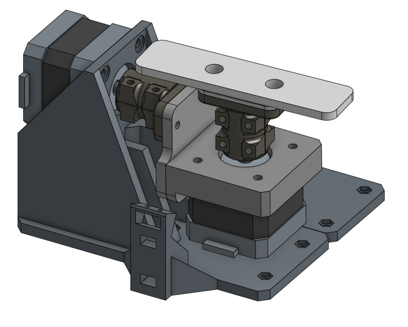
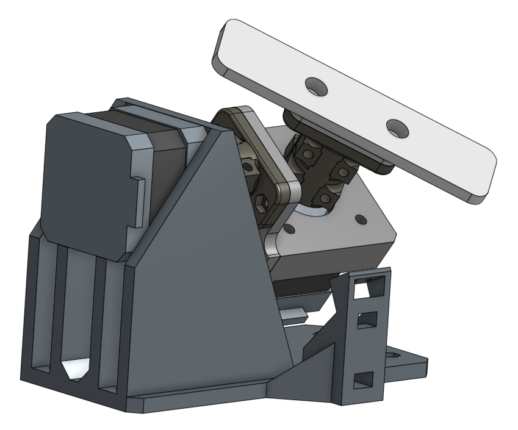
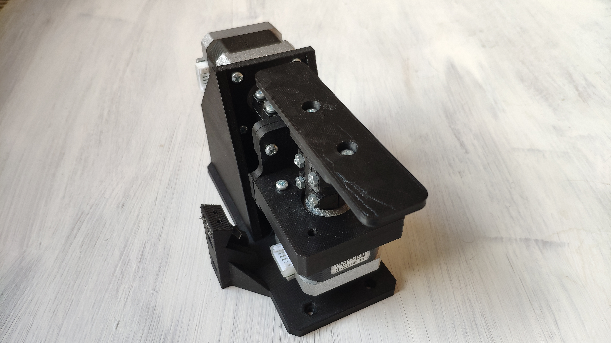
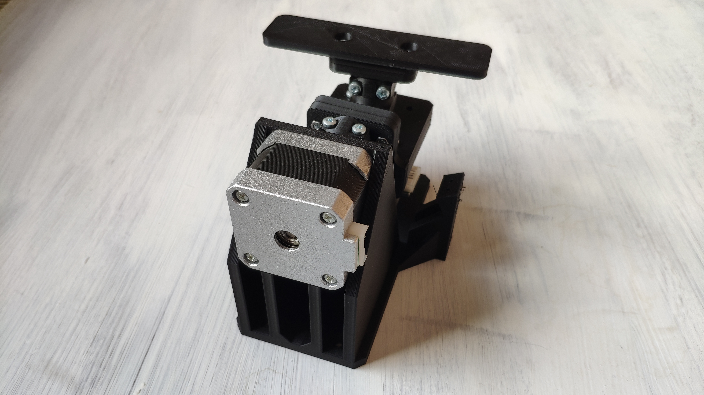
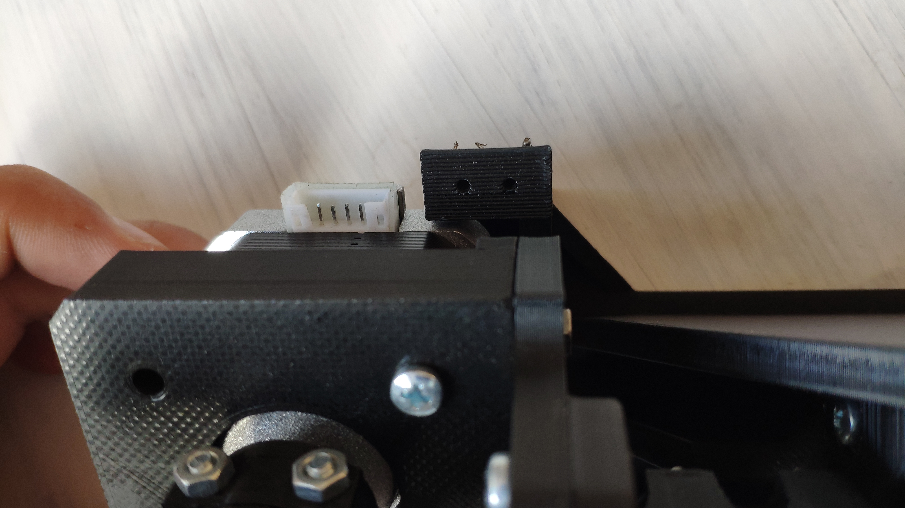

# pickup winding machine
## OnShape assembly view
https://cad.onshape.com/documents/01783b41ef1464628d930ea8/w/05c2e074727e56ec4ebd233c/e/07f4f639666ee8ac647a6556?renderMode=0&uiState=631c7eb0c7b6ee0087bfa460

electric guitar/bass pickup winding machine.

## pictures

